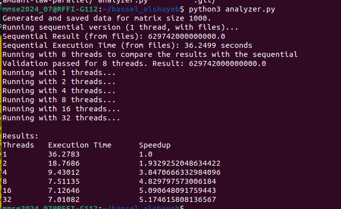
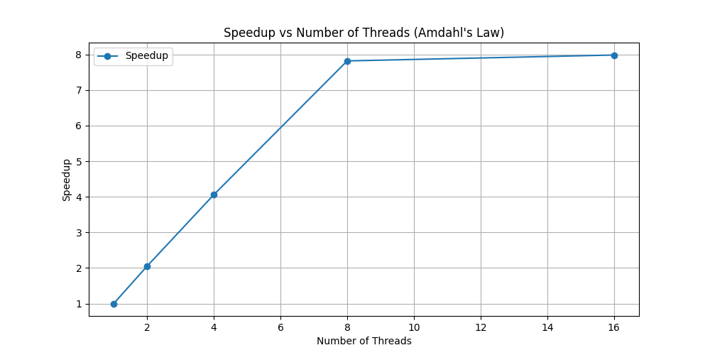
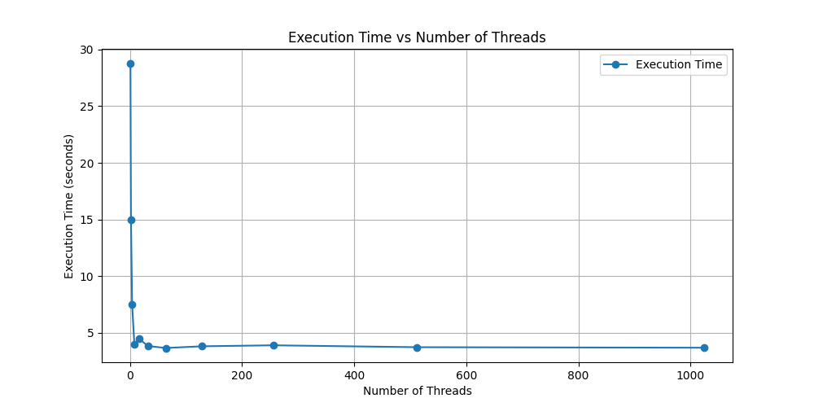

# Matrix Computation with OpenMP

### Студент
- Имя: Bassel Alshayeb - Басель Альшаеб
- ST: st123219

### Task

d = <B4 x, y>/<x, y> - <B3 x, y>/<x, y>
```
Задание A-07 (Басель Альшаеб)
Написать программу вычисления выражения:
d = <B4 x, y>/<x, y> - <B3 x, y>/<x, y>,
где B – квадратная плотная матрица, элементы которой имеют тип double, элементы матрицы
задаются с помощью генератора псевдослучайных чисел, x и y – векторы (элементы задаются
псевдослучайными числами), <,> - скалярное произведение.
Распараллелить эту программу с помощью OpenMP (parallel, task).
Исследовать зависимость масштабируемости параллельной версии программы от ее
вычислительной трудоемкости (размера матриц).
Проверить корректность параллельной версии.
Проверка закона Амдала. Построить зависимость ускорение:число потоков для заданного
примера.
Срок сдачи отчета 26.11.2024.

```
#### Объяснение

Для анализа:
- B — квадратная матрица.
- X и Y — векторы.
- <.,.> 
- Размер матрицы `1000` (для экстремального тестирования).

Программа поддерживает как **последовательное** выполнение, так и **параллельное** с использованием OpenMP. Реализована возможность использования данных из файла для проверки и верификации результатов.

---

### Решение
**1. Характеристики системы**

```
Operating System: Ubuntu 22.04.4 LTS
Kernel: 5.15.0-122-generic
Processer: Intel(R) Xeon(R) E-2136 CPU @ 3.30GHz 
Cores: 12
Architecture: x86_64
Memory: 62 G
Disk Space: 6.3 G
```

**2. Результаты измерений**

- Размер матрицы: 1000
- Последовательное время выполнения: 36.2499 Seconds
- Параллельное время выполнения: 

| Threads | Execution Time | Speedup |
| ------- | -------------- | ------- |
| 1 | 36.2499 | 1.0 |
| 2 | 21.1306 | 2.002872611284109 |
| 4 | 10.5706 | 4.003736779369193 |
| 8 | 7.03364 | 6.017069397921986 |
| 16 | 4.51372 | 9.376279432485843 |
| 32 | 4.09819 | 10.326973615181336 |
---


**3. Python Output**



**4. Speedup Diagram As Amdahl's Law**




**5. Execution Manager**




### Особенности
- Поддержка ввода матрицы и векторов из файлов или генерация случайных данных.
- Параллельные вычисления для умножения матриц и вычисления скалярных произведений с использованием OpenMP.
- Верификация корректности параллельного выполнения через последовательное выполнение.

---

### Требования
- **C++ Compiler with OpenMP Support** 
- **Python 3.10**

---

### Использование

**1. Compilation** \

Компиляция программы с поддержкой OpenMP main.cpp:

```bash
g++ -o main -fopenmp  main.cpp
```

**2. Execution** \

- Для полного тестирования используется Python с предустановленными значениями количества потоков

```
[1, 2, 4, 8, 16, 32]
```

- Запустите Python-скрипт для получения диаграмм и результатов

```bash
python3 analyzer.py
```
- Либо запустите программу вручную, указав количество потоков

```bash
export OMP_NUM_THREADS=X
./main
```

**3. Debugging** \

To run sequentialy and check the speed for:
```bash
export OMP_NUM_THREADS=1 
./main
```

---


### Вывод
1. C++:
- Печатает вычисленное значение 𝑑.
- Показывает время выполнения и отладочные данные

2. Python
- Отображает результаты для каждого количества потоков.
- Строит диаграммы зависимости ускорения от количества потоков.

